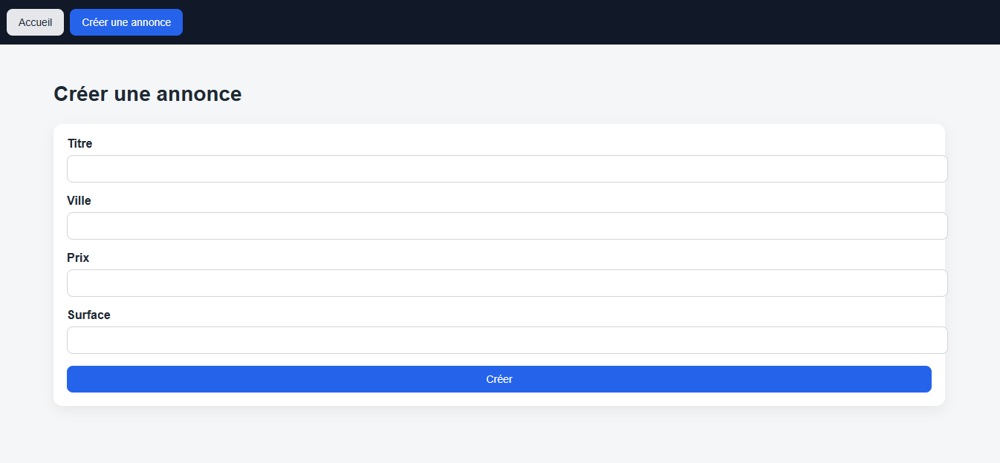
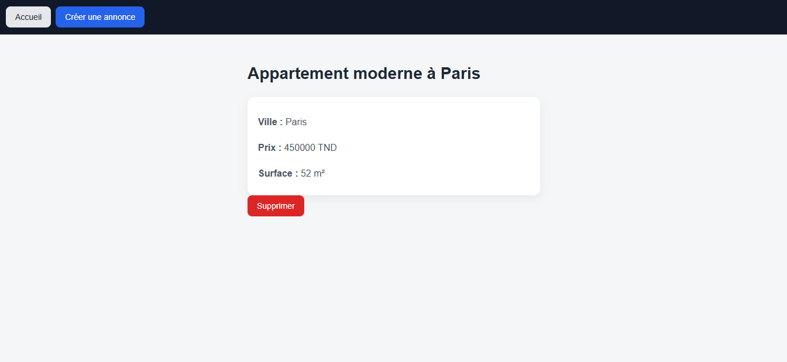

README — Mini application **Immobilier (Stage - Développeur Fullstack)**
========================================================================

> Ce README explique comment lancer le projet, présente l’architecture choisie, motive les choix, et liste les améliorations possibles si j’avais plus de temps.J’ai ajouté quelques captures d’écran (/screenshots) : accueil.png, create.png, detail.png.

1\. Démarrage (local / développement)
-------------------------------------

**Prérequis**

*   Node.js (>= 18 recommandé)
    
*   pnpm (le projet utilise pnpm + Turborepo)
    

**Installer les dépendances (racine du repo)**

```bash
# depuis la racine du monorepo
pnpm install
```
**Lancer tous les services (dev)**

```bash
# depuis la racine du monorepo
pnpm dev
```
*   frontend (Vite/React) → par défaut http://localhost:5173
    
*   backend (Fastify + TypeScript) → par défaut http://localhost:4000
    

**Lancer uniquement le backend**

```bash
pnpm --filter backend dev
```

**Lancer uniquement le frontend**

```bash
pnpm --filter frontend dev
```

2\. API
-------

Base : http://localhost:4000/api/items

*   { "data": \[ { /\* Property \*/ }, ... \], "meta": { "page":1, "limit":6, "total":7, "totalPages":2 }}
    
*   GET /api/items/:id → détail d’une annonce
    
*   POST /api/items → créer (body JSON: title, city, price, surface)
    
*   PUT /api/items/:id → mettre à jour
    
*   DELETE /api/items/:id → supprimer
    

**Exemples curl**
```bash
# create
curl -X POST http://localhost:4000/api/items \
 -H "Content-Type: application/json" \
 -d '{"title":"Appartement X","city":"Paris","price":123000,"surface":45}'


# get paginated
curl "http://localhost:4000/api/items?page=1&limit=6"

```

3\. Arborescence principale
---------------------------

**Backend (apps/backend/src)**
```bash
src/
├─ index.ts                # serveur Fastify (CORS, routes)
├─ routes/
│   └─ items.route.ts
├─ controllers/
│   └─ property.controller.ts
├─ services/
│   └─ property/
│       ├─ property.service.ts
│       └─ property.service.instance.ts
├─ repositories/
│   └─ property/
│       ├─ i-property.repository.ts
│       └─ property.repository.ts
├─ models/
│   └─ property.model.ts
├─ schemas/
│   └─ property.schema.ts  # Zod validators
├─ seeds/
│   └─ property.seed.ts

```


**Frontend (apps/frontend/src)**

```bash
src/
├─ main.tsx
├─ app/
│  ├─ router.tsx
│  └─ providers.tsx        # QueryClient, etc.
├─ pages/
│  ├─ PropertyListPage.tsx
│  ├─ PropertyDetailPage.tsx
│  └─ PropertyFormPage.tsx
├─ modules/
│  └─ property/
│     ├─ api/property.api.ts
│     ├─ hooks/            # useProperties, useProperty, mutations
│     ├─ containers/       # smart components
│     ├─ presentations/    # pure UI (dump components)
│     └─ validators/       # Zod form schemas
├─ components/             # atoms / molecules / organisms / templates
├─ core/
│  └─ api/http.ts          # axios instance
├─ models/
│  └─ property.model.ts
└─ styles/index.css


```

4\. Principes & patterns appliqués
----------------------------------

*   **Séparation des responsabilités (SoC)** : controllers / services / repositories / validators / models.
    
*   **Inversion de dépendance** : repository exposant une interface (IPropertyRepository) et injecté dans le service. Permet de remplacer l’implémentation in-memory par TypeORM / Prisma plus tard.
    
*   **Validation côté serveur** : Zod (schemas) appliqués dans les controllers avant appel aux services.
    
*   **Singletons contrôlés** : instance de service exportée (property.service.instance.ts) pour faciliter l’injection sans framework.
    
*   **Frontend feature-based** : chaque feature (property) contient ses api, hooks, vues, validators — facilite le découpage en micro-fronts / équipes.
    
*   **Atomic Design** : components/atoms, molecules, organisms, templates → réutilisabilité UI.
    
*   **Data fetching** : React Query (caching, invalidation, staleness), mutations propres (create/update/delete).
    
*   **Forms** : React Hook Form + Zod via resolver pour validation et UX rapide.
    
*   **Dev experience** : Turborepo + pnpm pour workspaces rapides et cohérence.
    

5\. Pourquoi cette architecture ?
---------------------------------

*   **Scalabilité** : séparation par feature + interfaces rend l’application facile à étendre (nouveaux modules : auth, users, payments).
    
*   **Testabilité** : repository mockable, services testables unit/integ.
    
*   **Maintenabilité** : code lisible, conventions claires, moins de risques de coupling.
    
*   **Transition facile vers prod** :Remplacer le stockage in-memory par une vraie DB (TypeORM/Prisma) sans changer les controllers ni le frontend, grâce à l'abstraction du repository.
*   **Sécurité** : Validation des données avec Zod à chaque étape (client + serveur), protection contre les injections et données malformées.

6\. Ce que j’aurais ajouté avec plus de temps
---------------------------------------------

Priorité haute :

*   **Persistance réelle** : connecter une base (Postgres) via TypeORM / Prisma + migrations.
    
*   **Auth minimal** : JWT + protection des endpoints write.
    
*   **Tests automatisés** : unit tests (Jest) pour services + integration tests (supertest) pour controllers.
    
*   **Docs API** : OpenAPI / Swagger auto-généré.
    
*   **File upload** : images pour annonces (S3 / local for demo).
    

Priorité moyenne :

*   Skeleton loaders, toasts, accesibilité (a11y), i18n si nécessaire.
    
*   Front: lazy loading des modules et code-splitting.

## 6. Des captures d'écrans

### Accueil - Page principale avec liste des propriétés


### Créer - Formulaire d'ajout d'une nouvelle annonce


### Détail - Vue détaillée d'une propriété

